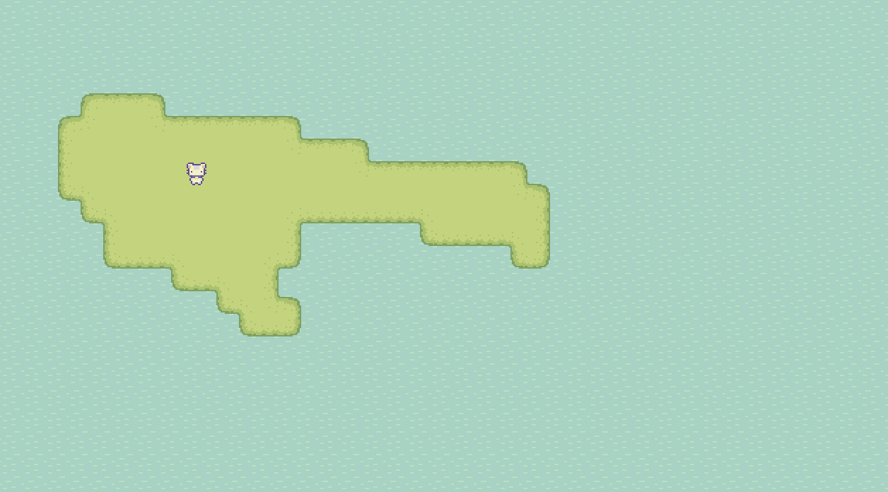
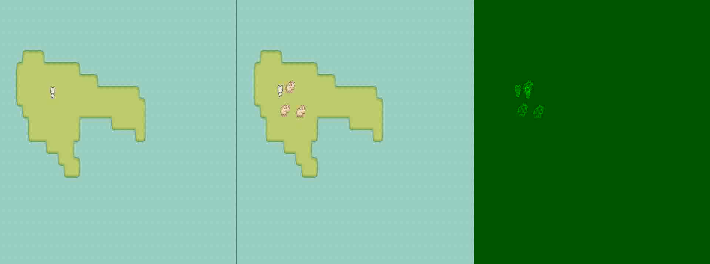

# Godot Visual Regression Testing

Inspired by [Factorio's visual regression testing](https://www.youtube.com/watch?v=LXnyTZBmfXM), this is 
an exploration of visual regression testing for Godot scenes.

## Concept

The idea is that we can generate videos from Godot scenes, and then compare those videos to a baseline (i.e. a previously
generated video that we know is correct).

## Quick Start

### Prerequisites

1. Install [Godot 4.4 Stable](https://godotengine.org/download)
2. Install imagemagick (with homebrew on macOS: `brew install imagemagick`)
3. Install ffmpeg (with homebrew on macOS: `brew install ffmpeg`)

### Download the executable

You can get it here: https://github.com/bahrmichael/godot-visual-regression-testing/releases/tag/alpha-0.1

You can also build it yourself by installing go 1.23 and running `go build .` in the root of this repository.

### Create a baseline video

```
godot-vrt-mac . --godot path_to_godot_binary --project path_to_project --scene scene.tscn
```

### Compare against a baseline video

```
godot-vrt-mac . --godot path_to_godot_binary --project path_to_project --scene scene.tscn --baseline baseline.avi
```

## Example

Below you can see a player character idling on an island. The character has an idling animation, that we want to
make sure doesn't change accidentally.



We first run this tool to generate a baseline video:

```shell
./godot-vrt-mac --godot /Applications/Godot.app/Contents/MacOS/Godot --project /Users/me/Downloads/sprout-lands --scene scenes/test/test_scene_npc_cow.tscn
```
 
This results in a video file being generated:

```text
Rendered scene at baseline_1221468695.avi
```

We can then run the tool again with the baseline video, and it will compare the generated video to the baseline video:

```shell
./godot-vrt-mac --godot /Applications/Godot.app/Contents/MacOS/Godot --project /Users/me/Downloads/sprout-lands --scene scenes/test/test_scene_npc_cow.tscn --baseline baseline_1221468695.avi
```

```text
No difference between the baseline and the scene.
```

If the generated video is different from the baseline video, the tool will output a message like this:

```text
Diff rendered at diff_1913836305.avi
```

You can then open the diff video to see what changed. It shows the two videos side by side, as well as a delta of the two.



## Open questions

### Seeding randomness

- How do we seed randomness so that NPC movement is deterministic?

### More complex scenarios

- Can we script behavior into scenes? E.g. make the player character move around in a deterministic way?

### Behavior of libraries

- Does ffmpeg always generate a green screen when there is no difference? Do the pixel values ever change?

## Tools used

- imagemagick
- ffmpeg
- go 1.23
- godot 4.4.stable
